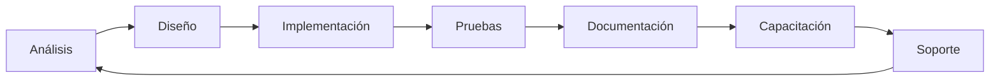

##  Oswaldo Antonio Choc Cuteres

<div align="center">
  
</div>

<div align="center">
  
[](https://linkedin.com/in/oswaldo-choc)
[](mailto:tu-email@ejemplo.com)
[](https://github.com/Oswaldo052001)

</div>

---

## 🎓 Sobre Mí

```javascript
const oswaldo = {
    ubicacion: "Guatemala, Guatemala 🇬🇹",
    educacion: {
        universidad: "Universidad de San Carlos de Guatemala (USAC)",
        carrera: "Ingeniería en Ciencias y Sistemas",
        carnet: "201901844",
        semestre: "7mo Semestre",
        estado: "Cursando"
    },
experienciaProfesional: {
    docente: {
        descripcion: "4 años como docente (Matemática, Física y Computación simultáneamente)",
        areas: ["Matemática Fundamental", "Física Fundamental", "Computación"],
            habilidades: [
                "Comunicación efectiva",
                "Explicación de conceptos técnicos",
                "Trabajo con grupos diversos",
                "Paciencia y didáctica"
            ]
        }
    },
    intereses: [
        "Desarrollo de Software",
        "Bases de Datos",
        "Arquitectura de Sistemas",
        "Implementación de Soluciones Tecnológicas",
        "Educación Tecnológica"
    ],
    fortaleza: "Combino conocimientos técnicos con habilidades de comunicación"
};
```

## 💼 Experiencia

### 👨‍🏫 Experiencia Docente
**4 años de experiencia enseñando** - Durante este periodo impartí clases de:
- 🎯 **Comunicación efectiva** para explicar conceptos técnicos complejos
- 👥 **Trabajo en equipo** y colaboración con personas de diferentes perfiles
- 📚 **Documentación clara** y materiales didácticos
- 🧩 **Resolución de problemas** adaptándome a diferentes estilos de aprendizaje
- ⏱️ **Gestión de tiempo** y organización de múltiples proyectos

**Áreas de enseñanza (simultáneamente durante 4 años):**
- Matemática Fundamental
- Física Fundamental  
- Computación

### 🎓 Proyectos Universitarios
Desarrollo constante de proyectos académicos en la USAC aplicando metodologías profesionales y tecnologías actuales.

---

## 🛠️ Stack Tecnológico

### Lenguajes de Programación


### Desarrollo Web


### Bases de Datos


### Herramientas y Tecnologías


---

## 📊 Estadísticas de GitHub

<div align="center">
  
  
</div>

<div align="center">
  
</div>

---

## 🚀 Proyectos Destacados - USAC

### 🏛️ Cursos y Áreas de Desarrollo

<table>
<tr>
<td width="50%">

#### 📚 OLC2 - Organización y Lenguajes de Computadoras 2
Desarrollo de **compiladores e intérpretes**
- Análisis léxico y sintáctico
- Generación de código
- Optimización de compiladores
- Manejo de errores y excepciones

</td>
<td width="50%">

#### 🗄️ MIA - Manejo e Implementación de Archivos
**Sistemas de gestión de archivos**
- Estructuras de datos avanzadas
- Árboles B+, Hash, AVL
- Manejo eficiente de memoria
- Simulación de sistemas de archivos

</td>
</tr>
<tr>
<td width="50%">

#### 🔄 REDES1 - Redes de Computadoras 1
**Implementación y simulación de redes**
- Protocolos TCP/IP
- Configuración de redes
- Análisis de tráfico
- Topologías de red

</td>
<td width="50%">

#### 🎯 AYD1 - Análisis y Diseño de Sistemas 1
**Desarrollo de sistemas empresariales**
- Metodología SCRUM
- Diagramas UML completos
- Arquitectura MVC
- APIs RESTful

</td>
</tr>
<tr>
<td width="50%">

#### 🔐 BD1 - Administración de Bases de Datos 1
**Diseño y optimización de BD**
- Procedimientos almacenados
- Triggers y funciones
- Sistema de respaldos
- Optimización de consultas

</td>
<td width="50%">

#### 🏗️ ACYE1 - Arquitectura y Ensambladores 1
**Programación de bajo nivel**
- Lenguaje ensamblador
- Arquitectura de computadoras
- Optimización de código
- Manejo de memoria

</td>
</tr>
</table>

---

## 🎯 Áreas de Especialización

<div align="center">

| Área | Habilidades |
|------|------------|
| **Backend** | Java, Python, Node.js, Express, APIs REST |
| **Frontend** | HTML5, CSS3, JavaScript, React |
| **Bases de Datos** | MySQL, PostgreSQL, MongoDB, PL/SQL, Optimización |
| **Metodologías** | SCRUM, Desarrollo Ágil, UML, Documentación |
| **Implementación** | Despliegue, Configuración, Integración de Sistemas |
| **Soft Skills** | Comunicación, Enseñanza, Trabajo en Equipo, Liderazgo |

</div>

---

## 💡 ¿Por qué mi perfil es diferente?

```python
ventaja_competitiva = {
    "formacion_tecnica": [
        "Estudiante de Ingeniería en Ciencias y Sistemas (USAC)",
        "Proyectos prácticos en múltiples áreas",
        "Stack tecnológico amplio y actualizado"
    ],
    "experiencia_profesional": [
        "4 años como docente (Matemática, Física, Computación)",
        "Capacidad de explicar conceptos técnicos complejos",
        "Experiencia trabajando con equipos diversos"
    ],
    "habilidades_unicas": [
        "Combino conocimientos técnicos con habilidades pedagógicas",
        "Excelente comunicación con usuarios técnicos y no técnicos",
        "Capacidad para crear documentación clara y efectiva",
        "Experiencia en capacitación y transferencia de conocimiento"
    ],
    "valor_para_igss": [
        "Implementación técnica + capacitación de usuarios",
        "Soporte técnico con excelente comunicación",
        "Documentación clara para diferentes audiencias",
        "Facilitador entre equipos técnicos y operativos"
    ]
}
```

---

## 📫 Conecta Conmigo

<div align="center">
  
[](https://github.com/Oswaldo052001)
[](https://linkedin.com/in/oswaldo-choc)
[](mailto:tu-email@ejemplo.com)
[](https://github.com/Oswaldo052001)

</div>

---

## 📈 Mi Enfoque Profesional

> **"La tecnología debe servir a las personas, no al revés."**

Como docente aprendí que la mejor solución técnica es aquella que el usuario puede entender y utilizar. Por eso, en cada proyecto busco:

1. 💻 **Excelencia Técnica** - Código limpio, eficiente y bien documentado
2. 👥 **Enfoque en el Usuario** - Soluciones que las personas puedan usar
3. 📚 **Documentación Clara** - Para que cualquiera pueda entender el sistema
4. 🤝 **Colaboración** - Trabajo efectivo con equipos multidisciplinarios
5. 📈 **Mejora Continua** - Siempre aprendiendo y actualizándome

---

## 🎓 Filosofía de Desarrollo

<div align="center">



</div>

> "No solo desarrollo sistemas, los implemento y enseño a usarlos."

---

## 🌟 Valores Profesionales

<div align="center">

| Valor | Aplicación |
|-------|-----------|
| 🎯 **Compromiso** | Dedicación completa a cada proyecto |
| 💡 **Innovación** | Búsqueda constante de mejores soluciones |
| 🤝 **Colaboración** | Trabajo efectivo en equipo |
| 📚 **Aprendizaje** | Actualización constante de conocimientos |
| ✨ **Calidad** | Excelencia en cada línea de código |
| 🇬🇹 **Servicio** | Compromiso con el desarrollo de Guatemala |

</div>

---

## 🎯 Objetivo Profesional

Busco contribuir al **Instituto Guatemalteco de Seguridad Social (IGSS)** como **Servicios Técnicos - Implementador**, donde pueda aplicar mis conocimientos en desarrollo de software, administración de bases de datos y mi experiencia en comunicación para:

- ✅ Implementar soluciones tecnológicas eficientes
- ✅ Capacitar a usuarios en el uso de sistemas
- ✅ Documentar procesos técnicos de forma clara
- ✅ Brindar soporte técnico de calidad
- ✅ Contribuir a la modernización tecnológica del país

---

## 📊 Actividad Reciente

<!--START_SECTION:activity-->
<!--END_SECTION:activity-->

---

## 🏆 Logros Académicos

- 🎓 Estudiante de 7mo semestre - Ingeniería en Ciencias y Sistemas (USAC)
- 👨‍🏫 4 años de experiencia docente
- 💻 Múltiples proyectos universitarios en diferentes áreas
- 📚 Formación continua en tecnologías actuales
- 🎯 Enfoque en desarrollo práctico y aplicable

---

<div align="center">
  
  
  ### 🌟 "Transformando conocimiento en soluciones" 🌟
  
  **De estudiante de la USAC y docente apasionado, para la excelencia profesional en tecnología** 🚀
  
  
</div>
